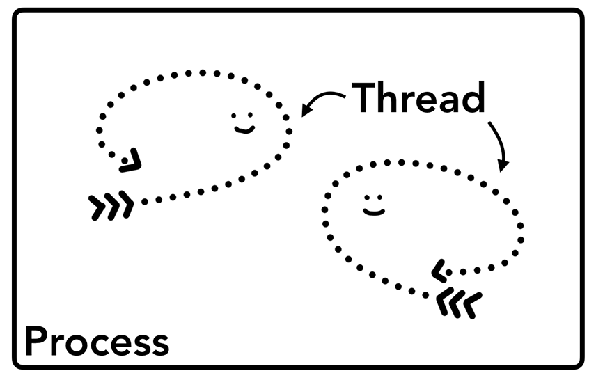
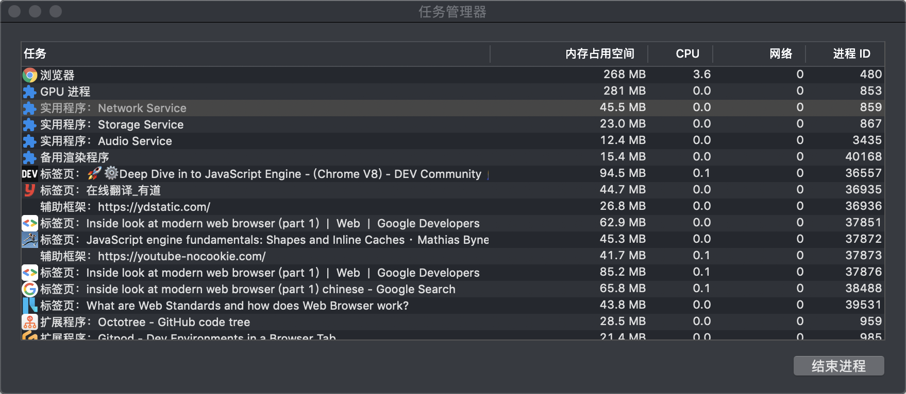

# 浏览器篇（一）-Chrome浏览器架构
发布于：2021-06-22

本篇作为浏览器篇的第一篇，万丈高楼平地起，知其然也要知其所以然，作为前端开发工程师我们几乎每天都要和浏览器打交道，从打开浏览器、输入url到页面渲染出来，这个过程中浏览器到底默默地为我们做了哪些事情？让我们一步一步来一探究竟。

## 背景知识

为了更好的理解浏览器架构，需要了解一些背景知识。浏览器作为应用程序运行在计算机上，自然是以进程的方式运行。那说到进程就不得不说到与进程相辅相成的线程。那么这两者怎么理解。

### 进程与线程 

概括起来说就是：

* 进程是程序的一次执行，线程是进程内部的一个执行序列；
* 进程是计算机资源分配的基本单位，线程是CPU的基本调度单位；
* 进程间相互独立；
* 进程间通信IPC（Inter Process Communication），线程间可以直接读写进程数据段（如全局变量）来进行通信 —— 需要进程同步和互斥手段的辅助，以保证数据的一致性。
* 进程间切换代价大，线程间切换代价小
* 多个线程共享进程的资源，一个线程死掉就等于整个进程死掉。所以多进程的程序要比多线程的程序健壮。

对进程和线程的理解有助于我们对Chrome浏览器多进程架构的理解。

## Chrome多进程架构

有了上面的背景知识，我们来一起看看浏览器的多进程架构。

打开chrome浏览器，浏览器是一个应用程序此时相关的进程已经创建。点击右上角的三个点，选择更多工具，选择任务管理器，这时会弹出一个任务管理器弹窗，在弹窗中列出了正在运行中的进程列表。

我的浏览器中打开了多个标签，多个网站，运行了一些插件，从上面的截图中可以看到，浏览器为每个标签都分配了一个进程，除此之外还可以看到GPU进程，插件进程，扩展程序进程等。由此可以看出Chrome浏览器是在以多进程的模式在为我们提供服务。

这里为什么要强调是Chrome浏览器呢？其实不同的浏览器实现是不同的，有的浏览器采用的是多线程架构，有的浏览器采用的是多进程架构。Chrome以多进程架构运行。

 

不同的进程负责不同的模块。

 

这里简单解释一下主要进程的作用：

* Browser Process （浏览器进程）： 控制地址栏，书签，后退和前进按钮，还有一些我们看不见的部分比如网络请求和文件访问。
* Renderer Process（渲染进程）：渲染进程控制网页的显示。也就是页面渲染都是由这部分控制。浏览器会为每个tab都分配一个渲染进程，同时也会为每一个站点分配不同的渲染进程比如iframes。
* Plugin Process （插件进程）： 插件进程控制网站插件的使用。
* GPU Process (Gpu进程)：独立于其他进程处理 GPU 任务。它被分成不同的进程，因为 GPU 处理来自多个应用程序的请求并将它们绘制在同一个表面上。

进程与进程之间相互协作，负责处理不同的部分：

想知道你的浏览器当前运行了哪些进程，可以去任务管理器中查看。

### 多进程架构优缺点

优点： 

* 基于进程的相互独立性，浏览器中tabs都是相互独立的进程，其中一个tab挂掉了不会影响到其他tab。
* 另外一个好处就是可以提供安全性和沙盒性（sanboxing）。因为操作系统可以提供方法让你限制每个进程拥有的能力，所以浏览器可以限制进程的某些能力。例如，由于tab渲染进程可能会处理来自用户的随机输入，所以Chrome限制了它们对系统文件随机读写的能力。

缺点：

* 因为进程拥有自己独立的内存空间，不能像线程那样共享内存，这就导致像V8引擎这样的公共基础架构没办法被共享，造成内存消耗。为了节省内存，Chrome 限制了它可以启动的进程数。能起多少进程取决于你的设备的内存和CPU。不过达到Chrome的极限后，Chrome会将访问同一个网站的tab都放在一个进程里面跑。

### 节省内存 - Chrome的服务化

Chrome 将浏览器的每个部分拆分为不同的服务，这样方便拆分和组合。当硬件设备比较好时Chrome将服务拆分到不同的进程中运行可以保证稳定性；在设备不那么好的设备上，Chrome将服务整合到同一个进程中这样可以节约内存。

### 单帧渲染进程 - 站点隔离

我们现在知道了Chrome为每个tab都单独起了一个进程，这样产生的问题是如果一个网页中嵌入了多个跨站点的iframe，不同站点之间共享内存空间，这样会产生安全隐患。同源策略是网络的核心安全模型；它确保一个站点未经同意无法访问其他站点的数据。绕过此策略是安全攻击的主要目标。基于进程之间相互隔离的特点，进程隔离是分离站点的最有效方法，Chrome 67以后默认启用站点隔离，选项卡中的每个跨站点 iframe 都有一个单独的渲染器进程。

## 参考资料

1. [Inside look at modern web browser](https://developers.google.com/web/updates/2018/09/inside-browser-part1)
2. [How JavaScript Works: Under the Hood of the V8 Engine](https://www.freecodecamp.org/news/javascript-under-the-hood-v8/)
3. [What are Web Standards and how does Web Browser work?](https://lyamkin.com/blog/what-are-web-standards-and-how-does-web-browser-work/)
4. [jsvu](https://github.com/GoogleChromeLabs/jsvu)
5.  [JavaScript engine fundamentals: Shapes and Inline Caches](https://mathiasbynens.be/notes/shapes-ics)
6. [Deep Dive in to JavaScript Engine - (Chrome V8)](https://dev.to/edisonpappi/how-javascript-engines-chrome-v8-works-50if)
7. [浏览器原理](https://github.com/yacan8/blog/issues/28)
8. [一文看懂Chrome浏览器运行机制](https://zhuanlan.zhihu.com/p/102149546)
